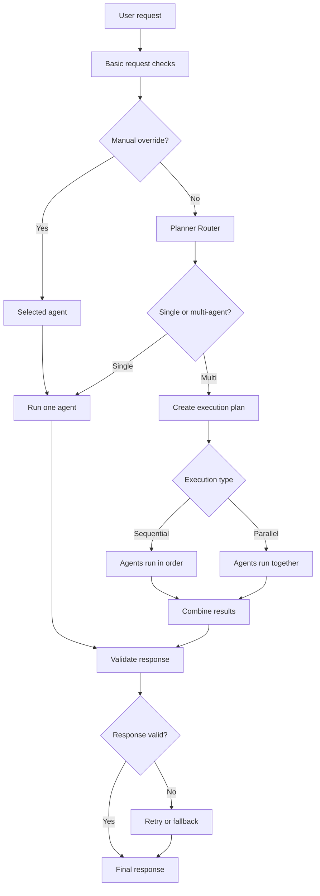

# Orchestrator Flow

```mermaid
flowchart TD
    user[User request] --> checks[Basic request checks]
    checks --> override{Manual override?}

    override -->|Yes| selected[Selected agent]
    override -->|No| planner[Planner Router]

    selected --> run_one[Run one agent]
    planner --> agent_count{Single or multi-agent?}

    agent_count -->|Single| run_one
    agent_count -->|Multi| plan[Create execution plan]
    plan --> execution_type{Execution type}

    execution_type -->|Sequential| sequential[Agents run in order]
    execution_type -->|Parallel| parallel[Agents run together]

    sequential --> combine[Combine results]
    parallel --> combine

    run_one --> validate[Validate response]
    combine --> validate

    validate --> valid{Response valid?}
    valid -->|Yes| final[Final response]
    valid -->|No| retry[Retry or fallback]
    retry --> final
```

